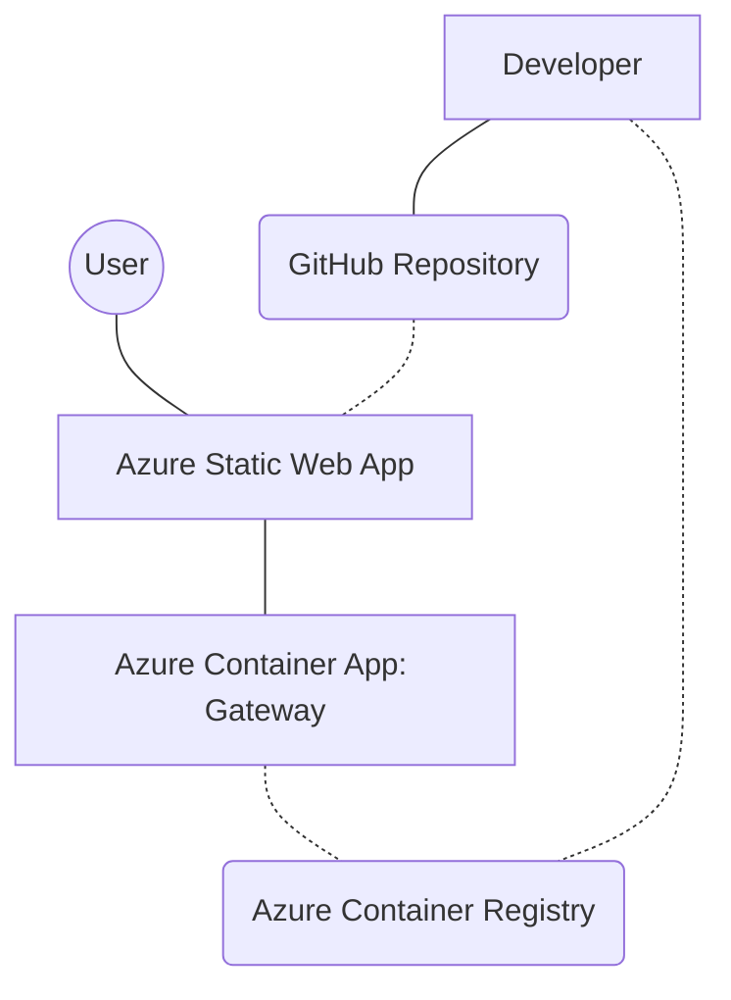

# Azure Microservices Deployment Lab

This repository implements a production-grade microservices architecture localized for the **SLIIT SE4010 (Current Trends in Software Engineering)** deployment lab. The implementation is fully containerized and orchestrated on Microsoft Azure.

---

## 🔗 Live Deployment (Final Output)

Your laboratory submission is now live at the following endpoints:

*   **🌐 Frontend Application:** [https://mango-plant-015c68f00.2.azurestaticapps.net](https://mango-plant-015c68f00.2.azurestaticapps.net)
*   **📡 API Gateway (Health Check):** [https://gateway.calmbay-7e7116db.centralindia.azurecontainerapps.io/health](https://gateway.calmbay-7e7116db.centralindia.azurecontainerapps.io/health)

---

## 🏗 System Architecture

The following diagram illustrates the microservices interaction and the CI/CD pipeline established between GitHub and Azure.

---

## 🚀 Key Features

*   **Managed Gateway:** A containerized Node.js (Alpine) Express server deployed on **Azure Container Apps**.
*   **Modern Frontend:** A responsive, glassmorphism-themed UI hosted on **Azure Static Web Apps**.
*   **Automated Pipeline:** Integrated GitHub Actions workflow for zero-touch deployment of the frontend assets.
*   **Full Observability:** Automated Log Analytics workspace provisioning for monitoring container health and traffic.

---

## 🛠 Tech Stack

| Domain | Technology |
| :--- | :--- |
| **Cloud** | Microsoft Azure (Container Apps, Static Web Apps, ACR) |
| **Service Layer** | Node.js, Express.js (v18+ Alpine) |
| **Client Layer** | HTML5, CSS3 (Glassmorphism), Vanilla JavaScript |
| **Infrastructure** | Docker, Azure CLI, GitHub Actions |

---

## 🚦 Deployment & Lifecycle

The project includes custom bash scripts for automated cloud lifecycle management:

1.  **Deployment:** `./deploy.sh` (Provisions RG, ACR, Environment, and Gateway).
2.  **Cleanup:** `./cleanup.sh` (Interactive script to decommission all resources).

---

## 👤 Author
**Student ID:** it22154880  
**Module:** Current Trends in Software Engineering (SE4010)  
**Institution:** SLIIT Faculty of Computing
