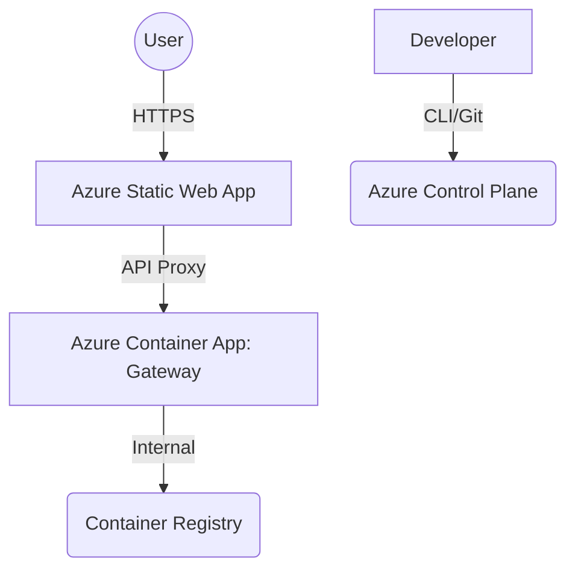

# Azure Microservices Deployment Lab

[](https://opensource.org/licenses/MIT)
[](https://azure.microsoft.com/)
[](https://nodejs.org/)
[](https://www.docker.com/)

This repository implements a production-grade microservices architecture localized for the **SLIIT SE4010 (Current Trends in Software Engineering)** deployment lab. The project demonstrates the seamless integration of containerized workloads with Microsoft Azure's managed services.

---

## 🏗 System Architecture

The following diagram illustrates the flow of a client request through the system, from the static frontend to the managed container gateway.



---

## 🚀 Key Features

*   **Managed Gateway:** A containerized Express.js server providing routing and system health endpoints.
*   **Modern Frontend:** A responsive, glassmorphism-themed UI designed for real-time interaction.
*   **Automation-First:** Includes `deploy.sh` and `cleanup.sh` for lifecycle management of cloud resources.
*   **Scalability:** Designed to run with managed environments that support auto-scaling and serverless execution.

---

## 🛠 Tech Stack

| Domain | Technology |
| :--- | :--- |
| **Cloud** | Microsoft Azure (Container Apps, Static Web Apps, ACR) |
| **Service Layer** | Node.js, Express.js (v18+ Alpine) |
| **Client Layer** | HTML5, CSS3 (Custom Design System), JavaScript |
| **Infrastructure** | Docker, Azure CLI |

---

## 🚦 Getting Started

### Prerequisites
*   **Azure CLI** & **Docker Desktop** installed and running.
*   A valid **Azure Subscription** (Azure for Students recommended).

### Setup & Deployment
1.  **Repository Setup:**
    ```bash
    git clone https://github.com/IsaraSE/CTSE-Lab07.git
    cd CTSE-Lab07
    ```

2.  **Full Cloud Deployment:**
    Execute the automated deployment script to provision and build all services:
    ```bash
    ./deploy.sh
    ```

3.  **Local Development:**
    To run the gateway locally for testing:
    ```bash
    cd gateway && npm install && npm start
    ```

---

## 🧹 Resource Management

Always decommission your resources after testing to avoid unnecessary cloud charges:
```bash
./cleanup.sh
```

---

## 👤 Author
**Student ID:** it22154880  
**Module:** Current Trends in Software Engineering (SE4010)  
**Institution:** SLIIT Faculty of Computing
