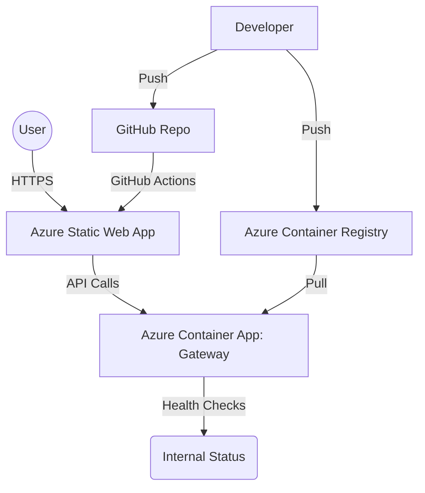

# Azure Microservices Deployment Lab


[](https://opensource.org/licenses/MIT)
[](https://azure.microsoft.com/)
[](https://nodejs.org/)
[](https://www.docker.com/)

## 🚀 Overview

This repository contains a full-stack microservices architecture designed for cloud-native deployment on **Microsoft Azure**. This project was developed for the **SLIIT Current Trends in Software Engineering (SE4010)** module to demonstrate best practices in containerization, service discovery, and cloud orchestration.

### Key Features
*   **API Gateway:** Robust routing and health monitoring using Express.js.
*   **Premium Frontend:** Glassmorphism UI with real-time API status tracking.
*   **Standardized Containers:** Dockerized services optimized for small footprint (`alpine` images).
*   **Cloud Infrastructure:** Automated provisioning of Resource Groups, Container Registries (ACR), and Container Apps Environment.
*   **Infrastructure as Code (IaC):** Integrated automation scripts for seamless deployment and cleanup.

---

## 🏗 Architecture



---

## 🛠 Tech Stack

| Category | Technologies |
| :--- | :--- |
| **Cloud Provider** | Microsoft Azure (Container Apps, Static Web Apps, ACR) |
| **Backend** | Node.js, Express.js |
| **Frontend** | HTML5, Modern CSS (Glassmorphism), Vanilla JavaScript |
| **DevOps** | Docker, Azure CLI, GitHub Actions |
| **Documentation** | Mermaid.js, Markdown, JSDoc |

---

## 🚦 Getting Started

### Prerequisites

*   **Azure CLI:** `brew install azure-cli`
*   **Docker Desktop:** Running locally
*   **Node.js:** v18.x or later

### Local Setup

1.  **Clone the Repository:**
    ```bash
    git clone https://github.com/IsaraSE/CTSE-Lab07.git
    cd CTSE-Lab07
    ```

2.  **Run Gateway:**
    ```bash
    cd gateway
    npm install
    npm start
    ```

3.  **Run Frontend:** Open `frontend/index.html` in your browser.

---

## ☁ Cloud Deployment

### Automated Provisioning

Run the integrated deployment script to build, push, and deploy all Azure resources:

```bash
./deploy.sh
```

### Manual Cleanup

To avoid ongoing charges, decommission all resources using the interactive cleanup script:

```bash
./cleanup.sh
```

---

## 📸 Screenshots

> [!TIP]
> Add your live deployment screenshots here to enhance your submission.

| Gateway Status | Frontend UI |
| :---: | :---: |
| *[Add Screenshot 1]* | *[Add Screenshot 2]* |

---

## 📝 License

Distributed under the MIT License. See `LICENSE` for more information.

## 👤 Author

**Student Name:** it22154880  
**Course:** SE4010 - Current Trends in Software Engineering  
**Institution:** SLIIT Faculty of Computing
